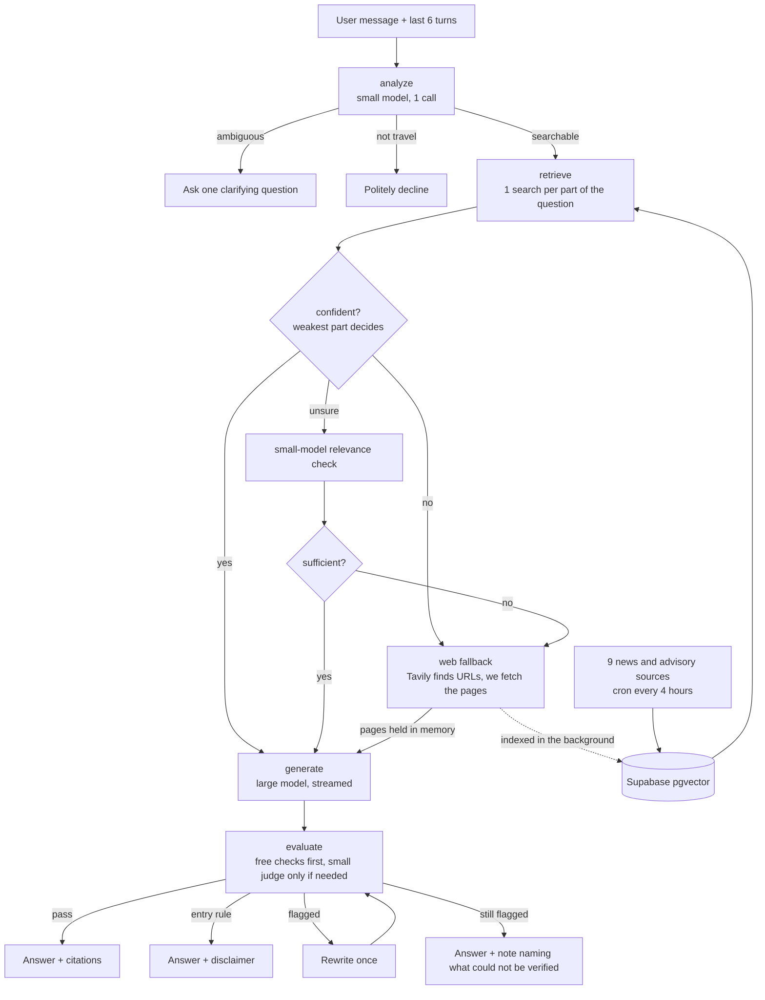

# Travel Assistant

A hybrid RAG chatbot for travel news. It answers from a curated index of scraped articles, asks a
clarifying question when a request is ambiguous, falls back to a live web search when the index is thin,
and checks every answer against its sources before showing it.

Built as a portfolio project, so the interesting parts are the measurements behind each design choice.
Those are in [`docs/decisions.md`](docs/decisions.md), with the numbers.

## How it works



| Layer | What it is |
|---|---|
| Ingestion | RSS discovery, `trafilatura` extraction, robots.txt-aware fetcher, dedupe by URL and content hash, cron every 4 hours |
| Store | Supabase Postgres with `pgvector` (HNSW). Chunks of 400 tokens with 50 overlap |
| Agent | LangGraph state machine (`src/travelrag/agent.py`) |
| Checker | Sentence-level similarity plus figure and name checks, then a small-model judge on suspicious claims only (`evaluation.py`) |
| API | FastAPI, streaming answers over server-sent events, per-client rate limit |
| UI | React + TypeScript + Vite: live progress, streamed answer, citations, how-it-was-answered trace |

Sources: Skift, The Points Guy, Simple Flying, Matador, UK FCDO travel advice, US State Department
advisories, The Hindu (travel), Economic Times (aviation), Travel and Tour World.

## Run it

You need Python 3.12, Node 20+, a Supabase project, an OpenAI key and a Tavily key.

```bash
cp .env.example .env         # fill in OPENAI_API_KEY, SUPABASE_DB_URL, TAVILY_API_KEY
make setup                   # venv and dependencies (about 30 seconds)
make migrate                 # create the tables
make doctor                  # checks config, database, pgvector and OpenAI
make ingest                  # first fill of the index (see the note below)
make api                     # terminal 1: backend on :8000
make web-install && make web # terminal 2: UI on http://localhost:5173
make test                    # 74 tests
make cron-install            # optional: re-scrape every 4 hours
```

The first `make ingest` takes roughly ten minutes, because the scraper waits two seconds between
requests to each site and embeds about 1,700 chunks. For a quick demo-sized index run
`.venv/bin/python -m travelrag.ingest --limit 10` instead. Re-running is safe: known articles are
skipped before any request is made.

## Try it: a five-minute demo

| Ask | What you should see |
|---|---|
| "Is it safe to travel to Iraq right now?" | Streams in about 3 seconds, cites the State Department advisory, badge "From the travel index", "Checked against sources" |
| "What's the best time to visit?" | One clarifying question ("Which destination?"). Reply "Japan" and it merges the two turns into one search |
| "Do I need a visa to visit Vietnam as a US citizen?" | Answers, then adds the not-legal-advice note: the checker adds it whenever an answer states an entry rule |
| "Tell me about flights from Kanpur to Delhi and Bangalore" | Splits into two searches; if the index lacks either route it goes to the web and covers both, in INR |
| "What is 2+2?" | Declines politely without searching, so it spends no Tavily credit |

Open **How this was answered** under any reply to see each step, the token count and anything the
checker flagged.

## What was measured

| | |
|---|---|
| Right path on the 41-query golden set | 40 / 41 (the miss is a strict-ranking check, not a wrong answer) |
| Detail questions where the answer text must be in the retrieved chunk | 7 / 8 with neighbour chunks, 1 / 8 without |
| Corrupted answers the checker catches | 13 / 16 |
| Clean answers it wrongly flags | 2 / 34 |
| Chat tokens per query | 3,733 (a plain retrieve-and-answer baseline is 3,033, with no checking or routing) |
| Time to first text | about 3.5 s for an index answer, about 13 s for a live three-part web search |

The three corrupted answers it misses are built only from words the sources already contain: a number
swapped for another real number from the same article, a reworded ratio, and an invented perk. Catching
them means running the judge on every answer, which is a cost decision. The pass threshold
(`EVAL_SIM_PASS`) is the dial, and `docs/decisions.md` shows the trade-off across thresholds.

## Design decisions worth defending

- **Ground facts, not shape.** Every price, date and name must come from a cited source, but arranging
  cited facts into an itinerary is allowed, and a labelled estimate may add sourced figures up. It never
  converts currencies. Getting the checker to judge facts and not shape took a rewrite: asked "is every
  statement supported?", it flagged "Day 1: arrive in Osaka".
- **Retrieval brings back neighbours.** The chunk that matches a question is rarely the one that answers
  it; the table sits next to the prose. Adding the adjacent chunks lifted detail recall from 1/8 to 8/8.
- **Free checks first.** Sentence similarity and figure checks run for the price of one embedding call.
  The model only sees the claims those checks found suspicious, with their four closest source lines,
  which cut judge cost by 70%.
- **The weakest part of a question decides.** A confident answer to half a question must not hide a half
  the index knows nothing about.
- **Models chosen by benchmark**, not reputation. `gpt-4.1-mini` routes and judges; the nano tiers were
  fast but scored 33 to 38 of 41 on routing because they over-clarify. `gpt-5.4-mini` writes answers.

## Known limits

- Rate limits are held in memory, per process. Fine for one server, not for several workers.
- No login. The rate limit and Tavily's daily cap bound spend, but do not expose the API publicly
  without adding authentication.
- Dollar costs are not quoted: prices for the two current models are not verified in `pricing.py`.
  Token counts are measured and stored per call.
- The US State Department blocks article pages, so its advisories come from the RSS feed text.
- Tavily is capped at 20 calls per day (`TAVILY_DAILY_CALL_CAP`); past that the assistant answers from
  the index and says so.
- Answers are English only.

## Layout

```
src/travelrag/   agent, evaluation, context, web fallback, ingest, api, config, llm, db
db/migrations/   numbered SQL migrations (make migrate)
data/            golden queries, adversarial cases, recorded Tavily responses for free replays
frontend/        React UI
tests/           74 tests. None calls OpenAI or Tavily; they need a filled .env, the Tavily-cap tests use your database
docs/            decisions.md (measurements and reasoning), repo-audit.md (a full code audit)
```

Evaluation tooling, run as modules: `agent_check` (all golden queries), `eval_check` (corrupted-answer
test), `baseline`, `retrieval_report`, `chunk_experiment`, `probe`, `stats`. Set
`TAVILY_USE_FIXTURES=true` to replay recorded web searches for free.
